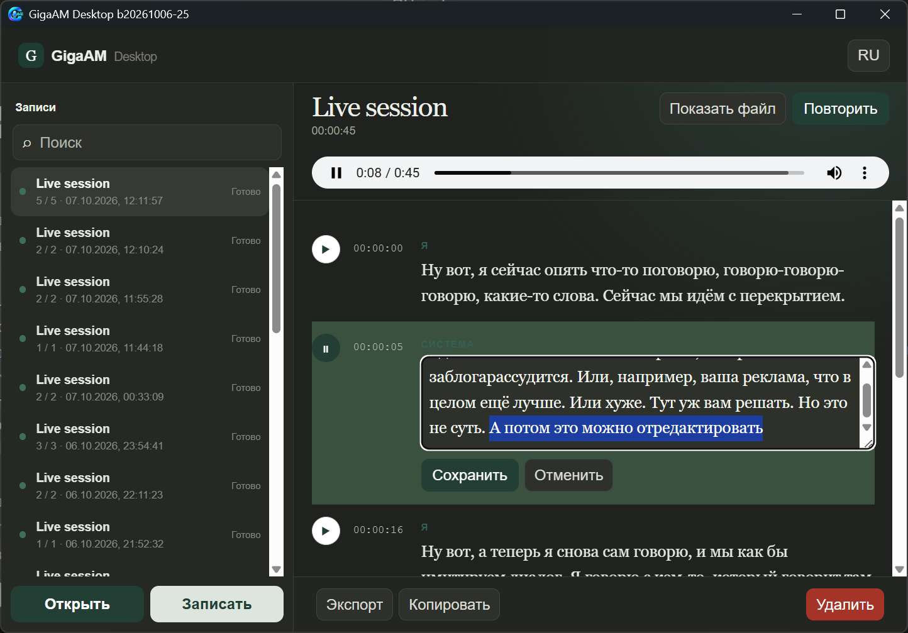
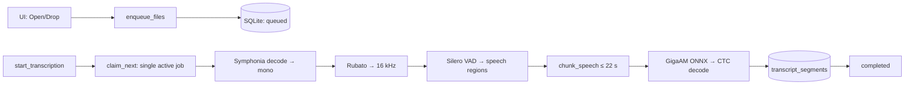
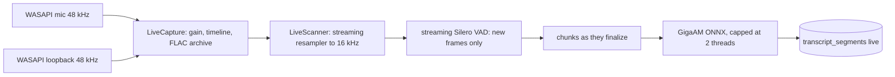
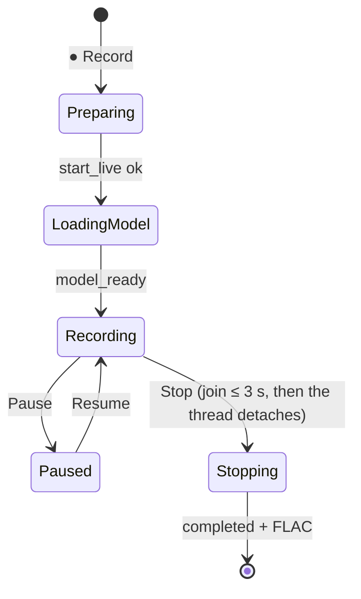

# GigaAM Desktop

> 🇷🇺 Документация на русском: [README.ru.md](README.ru.md)

Local audio/video transcription and live recording (microphone / system audio / both at once).
Tauri 2 + Svelte 5 + Rust, all inference on-device via ONNX Runtime; network is only needed
for the first model download.



## Features

- File transcription: WAV, MP3, FLAC, OGG, M4A, MP4, MKV, AVI, MOV (Symphonia decoding).
- Live recording: microphone, system audio (WASAPI loopback), or both tracks at once; microphone
  gain 0.5–10x adjustable even mid-recording; per-track lossless FLAC archive.
- Silero VAD + chunking + GigaAM v3 E2E CTC (int8) with punctuation.
- SQLite-backed queue and history: survives restarts, interrupted jobs are marked and retryable;
  search across filenames and transcript text.
- Export: TXT, SRT, WebVTT, JSON (filenames get a recording timestamp). Copy transcript,
  reveal source file in Explorer.
- Re-run recognition for any record, including completed ones. Retrying a dual live
  session re-transcribes each archived track separately, keeping microphone/system labels.
- Per-replica actions: play/pause from the timestamp column, inline text editing,
  full-text copy. Delete with confirmation dialog and the `Del` key.
- Pause/resume live recording with the elapsed timer frozen.

## Quick start

```powershell
npm install
npm run tauri dev     # dev mode: Vite HMR for the UI, automatic Rust rebuilds
```

```powershell
npm run check         # svelte-check
cargo test -p gigaam-desktop --lib   # Rust unit tests
npm run tauri build   # NSIS installer + portable exe under src-tauri/target/release
```

On first launch the app downloads ~227 MB of models into
`%APPDATA%\ru.gigaam.desktop\models`, verifying size and SHA-256.

## How it works

### File: queue → chunks → segments



### Live recording



Inference runs in 1 s ticks. Only the unsettled tail is re-scanned (the "quiet cursor"):
emitted audio and VAD-confirmed silence are never processed twice. Settled audio is
evicted from memory (`discard_before`), so the scan window stays small.

Dual sessions keep per-track FLAC archives plus `tracks.json` with track start offsets.
Playback uses a mixed WAV built on demand (`mixed_session_audio`); retrying a dual
session transcribes each archived track separately and merges segments by time,
preserving the microphone/system labels shown as Я / Система.



Recording diagnostics live in `%APPDATA%\ru.gigaam.desktop\gigaam-debug.log`:
start/stop phases, model load time, slow ticks, periodic stats
(`mic_fed/sys_fed`, inserted silence `gap_ms`, bad packets `err`, clock resyncs).

## Models (pinned, SHA-256 verified)

| Artifact | Size | SHA-256 |
| --- | ---: | --- |
| `v3_e2e_ctc.int8.onnx` (GigaAM v3 E2E CTC, rev `322c3b2`, HF `istupakov/gigaam-v3-onnx`) | 224,893,347 | `2e3fcb7a…1d0cfc9d28e` |
| `v3_e2e_ctc_vocab.txt` (257 tokens, blank 256) | 2,007 | `142de757…e6085273731` |
| `silero_vad.onnx` (official, rev `1e261b0`) | 2,327,524 | `1a153a22…79d8788e3` |

Full hashes and revisions live in `src-tauri/src/model_manager.rs` (`ARTIFACTS`).

## VAD and chunking parameters (`src-tauri/src/pipeline.rs`)

Speech threshold 0.5, silence threshold 0.35, minimum speech 200 ms, minimum silence 100 ms,
region padding 120 ms. Regions merge up to ~22 s, a pause after ~15 s is the preferred
boundary, continuous speech is cut no later than 22 s (hard limit 30 s).
VAD frame 512 samples, context 64, sample rate 16 kHz.

## Tauri commands (called by the UI)

Files: `enqueue_files`, `start_transcription`, `list_queue`, `list_history`,
`search_history`, `get_segments`, `cancel_transcription`, `retry_transcription`,
`remove_queue_item`, `delete_history`, `export_transcription`, `save_export`.
Recording: `start_live(source, microphone, keep_audio, mic_gain)`, `stop_live`,
`pause_live`, `resume_live`, `live_status`, `list_microphones`, `set_mic_gain`,
`session_audio_files`, `mixed_session_audio`, `update_segment_text`.
Model: `model_status`, `download_model`, `cancel_model_download`.

## Code signing policy

Windows releases are signed. Free code signing provided by [SignPath.io](https://signpath.io),
certificate by [SignPath Foundation](https://signpath.org).

- Committers and reviewers: repository collaborators.
- Approvers: repository owners.
- Every release is approved for signing manually; unsigned local builds are for development only.

## Stack

- UI: Svelte 5 (runes) + SvelteKit + Vite, `adapter-static` (no server, no Electron).
- Desktop: Tauri 2 — system WebView, single instance, asset protocol, dialog/fs/opener plugins.
- Core: Rust — `std` threads + `mpsc` (no async runtime in the hot paths).
- Audio: WASAPI via vendored `wasapi` (Windows), ScreenCaptureKit (macOS),
  Symphonia decode, Rubato resampling, `hound` WAV I/O, `flac-codec` archiving.
- Inference: ONNX Runtime via `ort` (statically linked), no Python.
- Storage: `rusqlite` (bundled SQLite, one file).
- I18n: RU/EN in-app toggle, no framework.

## Compactness

- NSIS installer ≈ 9 MB, portable exe ≈ 38 MB (ONNX Runtime statically linked).
- No Chromium/Node/Python shipped; no runtime downloads except the models below.
- Models (~227 MB) download once into OS app-data, verified by size + SHA-256.
- Transcripts live in one SQLite file; audio stays as per-track FLAC + on-demand mix.

## Storage

SQLite at `%APPDATA%\ru.gigaam.desktop\gigaam.sqlite3`: `transcriptions`
(metadata, status, chunk progress, audio path) and `transcript_segments`
(index, timings, text, track, speaker). States:
`queued → preparing → transcribing → completed`, plus
`cancelled / failed / interrupted`. Segments are written incrementally and cascade
only with their history record.

## Code layout

- `src/routes/+page.svelte` — the whole UI.
- `src-tauri/src/domain.rs` — transcription/segment types.
- `storage.rs` — SQLite, queue, status transitions.
- `pipeline.rs` — decode, resample, VAD, chunking, ONNX, CTC; `LiveScanner`.
- `queue.rs` — file-job coordinator (single active job, multi-track retry merge).
- `live.rs` — WASAPI capture (Windows, `vendor/wasapi`), ScreenCaptureKit (macOS),
  FLAC archive, microphone gain.
- `lib.rs` — commands, file worker, live inference thread.
- `model_manager.rs` — model download and verification.
- `export.rs` — TXT/SRT/VTT/JSON.
- `src-tauri/src/bin/inference_spike.rs` — single-file benchmark harness
  (`--features inference-spike`).
