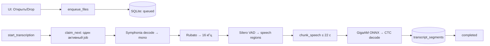
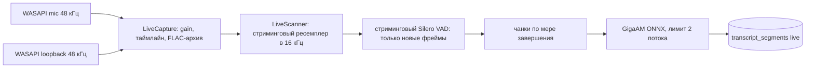
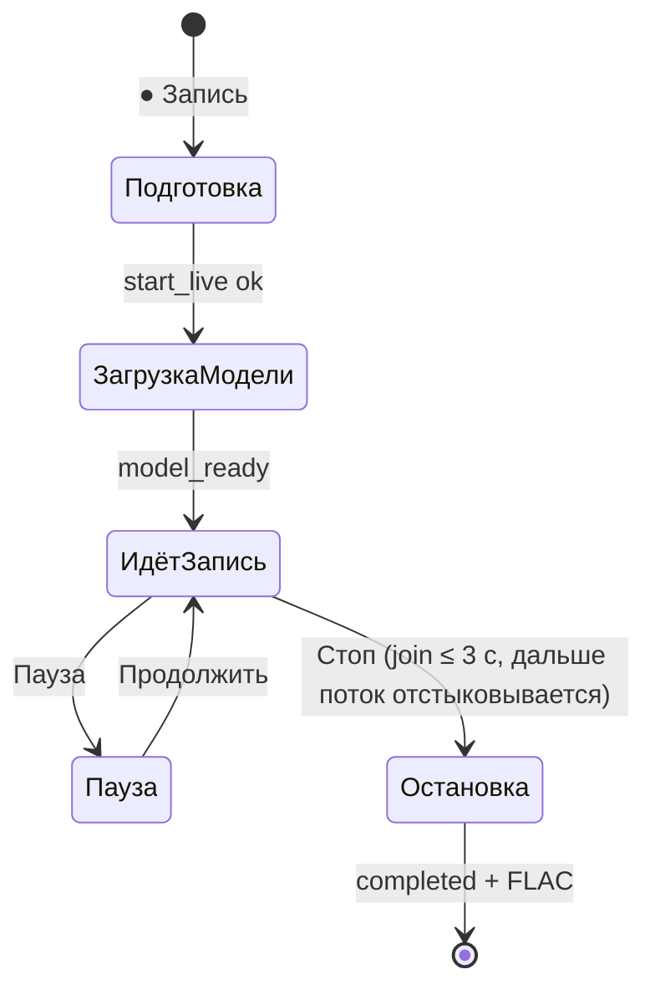

# GigaAM Desktop

> 🇬🇧 English docs: [README.md](README.md)

Локальная транскрибация аудио/видео и живая запись (микрофон / системный звук / оба сразу).
Tauri 2 + Svelte 5 + Rust, весь инференс на устройстве через ONNX Runtime, сеть нужна только для
первой загрузки моделей.


## Возможности

- Транскрибация файлов: WAV, MP3, FLAC, OGG, M4A, MP4, MKV, AVI, MOV (декодирование — Symphonia).
- Живая запись: микрофон, системный звук (WASAPI loopback) или оба трека одновременно; усиление
  микрофона 0.5–10× настраивается прямо во время записи; сохранение lossless FLAC по трекам.
- VAD Silero + чанкинг + GigaAM v3 E2E CTC (int8) с пунктуацией.
- История и очередь на SQLite: переживает перезапуск, недописанное помечается «Прервано» и
  перезапускается; поиск по именам и тексту.
- Экспорт: TXT, SRT, WebVTT, JSON (в имя файла добавляется таймстемп записи).
  Копирование транскрипта, показ исходника в проводнике.
- Повтор распознавания для любой записи, включая уже готовые. Ретрай dual-записи
  транскрибирует каждый архивный трек отдельно, сохраняя подписи микрофона/системы.
- Действия с репликами: play/пауза из колонки времени, правка текста инлайн,
  копирование всего текста. Удаление с диалогом подтверждения и клавишей `Del`.
- Пауза/продолжение живой записи с замороженным таймером.

## Быстрый старт

```powershell
npm install
npm run tauri dev     # dev-режим: Vite HMR для UI, автопересборка Rust
```

```powershell
npm run check         # svelte-check
cargo test -p gigaam-desktop --lib   # Rust unit-тесты
npm run tauri build   # NSIS-установщик + portable exe в src-tauri/target/release
```

При первом старте приложение скачивает ~227 МБ моделей в
`%APPDATA%\ru.gigaam.desktop\models` с проверкой размера и SHA-256.

## Как это работает

### Файл: очередь → чанки → сегменты



### Живая запись



Инференс идёт тиками по 1 с. Пересканируется только неподтверждённый хвост
(«тихий курсор»): отданное аудио и VAD-подтверждённая тишина повторно не обрабатываются.
Отработанное выгружается из памяти (`discard_before`), окно сканирования всегда маленькое.

Dual-сессии хранят потрековые FLAC-архивы плюс `tracks.json` со стартовыми оффсетами.
Проигрывание идёт наложенным WAV, собранным по запросу (`mixed_session_audio`); ретрай
dual-записи транскрибирует каждый архивный трек отдельно и сливает сегменты по времени,
сохраняя подписи микрофона/системы (в UI — «Я» / «Система»).



Диагностика записи — `%APPDATA%\ru.gigaam.desktop\gigaam-debug.log`:
фазы старта/стопа, время загрузки модели, медленные тики, статистика
(`mic_fed/sys_fed`, вставки тишины `gap_ms`, битые пакеты `err`, ресинки часов).

## Модели (зафиксированы, проверяются по SHA-256)

| Артефакт | Размер | SHA-256 |
| --- | ---: | --- |
| `v3_e2e_ctc.int8.onnx` (GigaAM v3 E2E CTC, rev `322c3b2`, HF `istupakov/gigaam-v3-onnx`) | 224 893 347 | `2e3fcb7a…1d0cfc9d28e` |
| `v3_e2e_ctc_vocab.txt` (257 токенов, blank 256) | 2 007 | `142de757…e6085273731` |
| `silero_vad.onnx` (официальный, rev `1e261b0`) | 2 327 524 | `1a153a22…79d8788e3` |

Полные хэши и ревизии — в `src-tauri/src/model_manager.rs` (`ARTIFACTS`).

## Параметры VAD и чанкинга (`src-tauri/src/pipeline.rs`)

Порог речи 0.5, порог тишины 0.35, минимум речи 200 мс, минимум тишины 100 мс,
паддинг регионов 120 мс. Регионы склеиваются до ~22 с, пауза после ~15 с — preferred
граница, непрерывная речь режется не позже 22 с (жёсткий лимит 30 с).
Фрейм VAD 512 сэмплов, контекст 64, частота 16 кГц.

## Tauri-команды (вызывает UI)

Файлы: `enqueue_files`, `start_transcription`, `list_queue`, `list_history`,
`search_history`, `get_segments`, `cancel_transcription`, `retry_transcription`,
`remove_queue_item`, `delete_history`, `export_transcription`, `save_export`.
Запись: `start_live(source, microphone, keep_audio, mic_gain)`, `stop_live`,
`pause_live`, `resume_live`, `live_status`, `list_microphones`, `set_mic_gain`,
`session_audio_files`, `mixed_session_audio`, `update_segment_text`.
Модель: `model_status`, `download_model`, `cancel_model_download`.

## Стек

- UI: Svelte 5 (runes) + SvelteKit + Vite, `adapter-static` (без сервера, без Electron).
- Десктоп: Tauri 2 — системный WebView, single instance, asset protocol, плагины
  dialog/fs/opener.
- Ядро: Rust — `std`-потоки + `mpsc` (без async-рантайма на горячих путях).
- Аудио: WASAPI через вендорный `wasapi` (Windows), ScreenCaptureKit (macOS),
  декод Symphonia, ресемпл Rubato, WAV через `hound`, архив `flac-codec`.
- Инференс: ONNX Runtime через `ort` (статическая линковка), без Python.
- Хранилище: `rusqlite` (встроенный SQLite, один файл).
- I18n: переключатель RU/EN в приложении, без фреймворков.

## Компактность

- NSIS-установщик ≈ 9 МБ, portable exe ≈ 38 МБ (ONNX Runtime слинкован статически).
- Не поставляются Chromium/Node/Python; сетевых загрузок в рантайме нет, кроме моделей ниже.
- Модели (~227 МБ) качаются один раз в OS app-data с проверкой размера и SHA-256.
- Транскрипты — в одном SQLite-файле; аудио — потрековые FLAC + микс по запросу.

## Хранилище

SQLite `%APPDATA%\ru.gigaam.desktop\gigaam.sqlite3`: таблицы `transcriptions`
(метаданные, статус, прогресс чанков, путь аудио) и `transcript_segments`
(индекс, тайминги, текст, трек, спикер). Статусы:
`queued → preparing → transcribing → completed`, плюс
`cancelled / failed / interrupted`. Сегменты пишутся инкрементально, каскадно
удаляются только вместе с записью истории.

## Структура кода

- `src/routes/+page.svelte` — весь UI.
- `src-tauri/src/domain.rs` — типы транскрипций/сегментов.
- `storage.rs` — SQLite, очередь, переходы статусов.
- `pipeline.rs` — декод, ресемпл, VAD, чанкинг, ONNX, CTC; `LiveScanner`.
- `queue.rs` — координатор файловых задач (одна активная, слияние потрекового ретрая).
- `live.rs` — WASAPI-захват (Windows, `vendor/wasapi`), ScreenCaptureKit (macOS),
  FLAC-архив, усиление микрофона.
- `lib.rs` — команды, воркер файлов, поток live-инференса.
- `model_manager.rs` — скачивание и проверка моделей.
- `export.rs` — TXT/SRT/VTT/JSON.
- `src-tauri/src/bin/inference_spike.rs` — стенд разового прогона файла
  (`--features inference-spike`).
